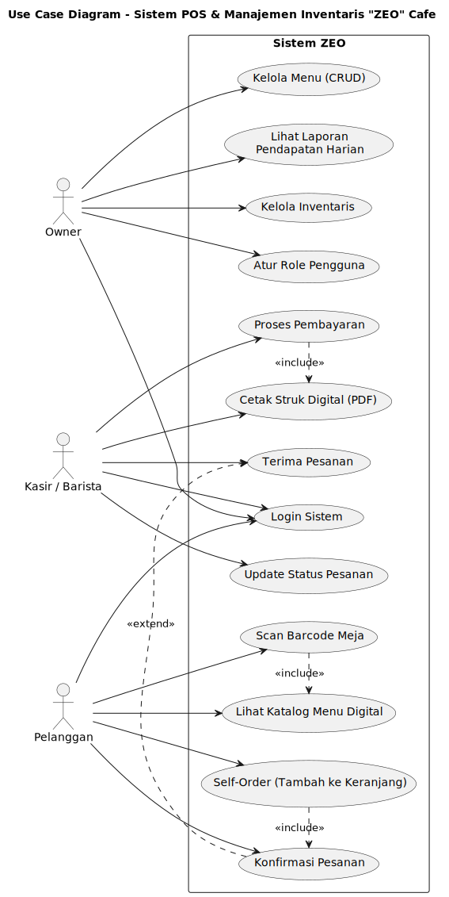

# Diagrams – Sistem POS & Manajemen Inventaris "ZEO" Cafe

Repositori ini berisi tiga diagram UML yang dibuat menggunakan **PlantUML** untuk mendokumentasikan arsitektur dan alur kerja sistem **ZEO** — sistem Point of Sale (POS) dan manajemen inventaris untuk sebuah kafe.

---

## Daftar Diagram

| File | Jenis | Deskripsi singkat |
|------|-------|-------------------|
| `use_case_diagram.puml` / [`use_case_diagram_zeo.svg`](use_case_diagram_zeo.svg) | Use Case Diagram | Interaksi aktor dengan sistem |
| `activity_diagram.puml` / [`activity_diagram_zeo.svg`](activity_diagram_zeo.svg) | Activity Diagram | Alur proses pemesanan end-to-end |
| `class_diagram.puml` / [`class_diagram_zeo.svg`](class_diagram_zeo.svg) | Class Diagram | Struktur kelas dan relasi antar objek |

---

## 1. Use Case Diagram (`use_case_diagram.puml`)

### Tujuan
Menggambarkan **siapa** yang berinteraksi dengan sistem dan **apa** yang dapat mereka lakukan.

### Aktor

| Aktor | Peran |
|-------|-------|
| **Owner** | Pemilik kafe — mengelola seluruh operasional bisnis |
| **Kasir / Barista** | Staf kafe — melayani pesanan dan pembayaran |
| **Pelanggan** | Pengunjung kafe — memesan secara mandiri melalui perangkat di meja |

### Use Cases per Aktor

**Owner**
- Login Sistem *(bersama semua aktor)*
- Kelola Menu (CRUD) — tambah, ubah, hapus, dan melihat daftar menu
- Lihat Laporan Pendapatan Harian
- Kelola Inventaris — memantau dan memperbarui stok bahan baku
- Atur Role Pengguna — menetapkan hak akses staf

**Kasir / Barista**
- Login Sistem
- Terima Pesanan — mendapat notifikasi pesanan masuk
- Proses Pembayaran — memverifikasi dan menerima pembayaran
- Cetak Struk Digital (PDF) — menghasilkan bukti transaksi
- Update Status Pesanan — mengubah status (diproses / siap / selesai)

**Pelanggan**
- Login Sistem
- Scan Barcode Meja — memindai kode QR di meja untuk membuka aplikasi
- Lihat Katalog Menu Digital — menelusuri menu yang tersedia
- Self-Order (Tambah ke Keranjang) — memilih item secara mandiri
- Konfirmasi Pesanan — mengirim pesanan ke dapur / kasir

### Relasi Antar Use Case
- `<<include>>`: Proses Pembayaran **selalu** menyertakan Cetak Struk; Scan Barcode **selalu** membuka Katalog; Tambah Keranjang **selalu** berujung pada Konfirmasi.
- `<<extend>>`: Konfirmasi Pesanan (oleh Pelanggan) **dapat memperluas** Terima Pesanan (oleh Kasir).

### Diagram



---

## 2. Activity Diagram (`activity_diagram.puml`)

### Tujuan
Menggambarkan **alur kerja** proses pemesanan dari awal hingga selesai menggunakan tiga *swimlane*.

### Swimlanes

| Swimlane | Tanggung Jawab |
|----------|----------------|
| **Pelanggan** | Memulai pemesanan, memilih menu, konfirmasi |
| **Kasir** | Menerima notifikasi, menyiapkan pesanan, memproses pembayaran |
| **Sistem** | Otomasi backend: simpan data, kirim notifikasi, kurangi stok, catat laporan |

### Alur Utama
1. **Pelanggan** men-scan barcode meja → halaman menu terbuka.
2. **Sistem** menampilkan katalog menu digital.
3. **Pelanggan** memilih menu dan menambah ke keranjang *(loop — dapat menambah lebih dari satu item)*.
4. **Pelanggan** mengkonfirmasi pesanan.
5. **Sistem** secara paralel menyimpan pesanan ke database *dan* mengirim notifikasi ke Kasir.
6. **Kasir** menerima notifikasi → menyiapkan pesanan → memperbarui status.
7. **Sistem** mengurangi stok inventaris secara otomatis dan mencatat ke laporan harian.
8. **Kasir** memproses pembayaran *(loop retry jika gagal)*:
   - **Valid** → konfirmasi → catat transaksi → cetak struk → Pelanggan menerima struk → selesai.
   - **Tidak valid** → informasikan ke Pelanggan → Pelanggan memperbaiki pembayaran → kembali ke langkah 8.

### Diagram



---

## 3. Class Diagram (`class_diagram.puml`)

### Tujuan
Menggambarkan **struktur kelas**, atribut, metode, dan **relasi** antar kelas dalam sistem ZEO.

### Kelas-Kelas

#### Hierarki Pengguna (Inheritance)

```
User (abstract)
├── Owner
├── Kasir
└── Pelanggan
```

| Kelas | Atribut Utama | Metode Utama |
|-------|---------------|--------------|
| **User** *(abstract)* | id, nama, username, password | login() |
| **Owner** | *(mewarisi User)* | kelolaMenu(), lihatLaporan(), kelolaInventaris(), aturRolePengguna() |
| **Kasir** | *(mewarisi User)* | terimaPesanan(), prosesPembayaran(), cetakStruk(), updateStatusPesanan() |
| **Pelanggan** | noMeja | lihatKatalog(), tambahKeranjang(), konfirmasiPesanan() |

#### Kelas Domain

| Kelas | Atribut Utama | Metode Utama |
|-------|---------------|--------------|
| **Menu** | idMenu, namaMenu, harga, status | tampilkanMenu(), updateStatus() |
| **Pesanan** | idPesanan, waktu, status, totalHarga | hitungTotal(), updateStatus() |
| **DetailPesanan** | idDetail, jumlah, hargaSatuan | getSubtotal() |
| **Inventaris** | idBahan, namaBahan, stokSaatIni, satuan | kurangiStok(), cekKetersediaan() |
| **Transaksi** | idTransaksi, metodeBayar, totalBayar, kembalian | hitungKembalian(), generateStruk() |
| **Laporan** | idLaporan, tanggal, totalPendapatan | generateLaporan(), eksporPDF() |
| **Notifikasi** | idNotifikasi, pesan, waktu, sudahDibaca | kirim(), tandaiDibaca() |

#### Relasi Antar Kelas

| Relasi | Kelas A | Kelas B | Keterangan |
|--------|---------|---------|------------|
| Inheritance | Owner / Kasir / Pelanggan | User | Semua pengguna mewarisi User |
| **Composition** ◆ | Pesanan | DetailPesanan | DetailPesanan tidak dapat berdiri sendiri tanpa Pesanan |
| Association | Kasir | Pesanan | Kasir mengelola pesanan |
| Association | Pelanggan | Pesanan | Pelanggan membuat pesanan |
| Association | DetailPesanan | Menu | Setiap detail pesanan merujuk ke satu menu |
| Association | Pesanan | Transaksi | Satu pesanan menghasilkan satu transaksi |
| Association | Transaksi | Laporan | Transaksi dicatat ke laporan harian |
| Association | Inventaris | Pesanan | Stok berkurang ketika pesanan diproses |
| Association | Owner | Menu / Inventaris / Laporan | Owner mengelola menu, inventaris, dan laporan |
| Association | Pesanan | Notifikasi | Pesanan menghasilkan notifikasi ke kasir |
| Association | Notifikasi | Kasir | Kasir menerima notifikasi pesanan masuk |

### Diagram



---

## Cara Melihat Diagram

### Menggunakan PlantUML Online
1. Buka [https://www.plantuml.com/plantuml/uml/](https://www.plantuml.com/plantuml/uml/)
2. Salin isi salah satu file `.puml` ke editor.
3. Diagram akan dirender otomatis.

### Menggunakan VS Code
1. Instal ekstensi **PlantUML** (`jebbs.plantuml`).
2. Buka file `.puml`.
3. Tekan `Alt+D` untuk pratinjau langsung.

### Menggunakan CLI (jar)
```bash
java -jar plantuml.jar *.puml
```
File PNG akan dihasilkan di direktori yang sama.

---

## Teknologi
- **Notasi**: UML 2.x
- **Rendering**: [PlantUML](https://plantuml.com/)
- **Bahasa deskripsi**: PlantUML DSL (`.puml`)